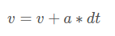
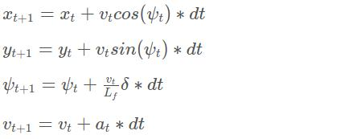
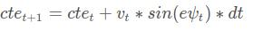
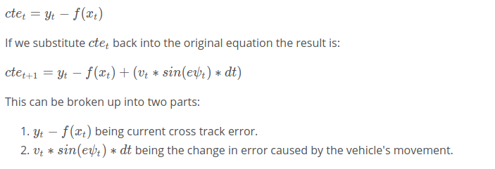
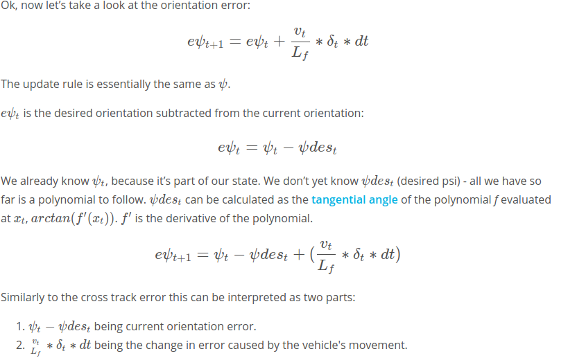

# CarND-Controls-MPC
Self-Driving Car Engineer Nanodegree Program

---

## Dependencies

* cmake >= 3.5
 * All OSes: [click here for installation instructions](https://cmake.org/install/)
* make >= 4.1(mac, linux), 3.81(Windows)
  * Linux: make is installed by default on most Linux distros
  * Mac: [install Xcode command line tools to get make](https://developer.apple.com/xcode/features/)
  * Windows: [Click here for installation instructions](http://gnuwin32.sourceforge.net/packages/make.htm)
* gcc/g++ >= 5.4
  * Linux: gcc / g++ is installed by default on most Linux distros
  * Mac: same deal as make - [install Xcode command line tools]((https://developer.apple.com/xcode/features/)
  * Windows: recommend using [MinGW](http://www.mingw.org/)
* [uWebSockets](https://github.com/uWebSockets/uWebSockets)
  * Run either `install-mac.sh` or `install-ubuntu.sh`.
  * If you install from source, checkout to commit `e94b6e1`, i.e.
    ```
    git clone https://github.com/uWebSockets/uWebSockets
    cd uWebSockets
    git checkout e94b6e1
    ```
    Some function signatures have changed in v0.14.x. See [this PR](https://github.com/udacity/CarND-MPC-Project/pull/3) for more details.

* **Ipopt and CppAD:** Please refer to [this document](https://github.com/udacity/CarND-MPC-Project/blob/master/install_Ipopt_CppAD.md) for installation instructions.
* [Eigen](http://eigen.tuxfamily.org/index.php?title=Main_Page). This is already part of the repo so you shouldn't have to worry about it.
* Simulator. You can download these from the [releases tab](https://github.com/udacity/self-driving-car-sim/releases).
* Not a dependency but read the [DATA.md](./DATA.md) for a description of the data sent back from the simulator.


## Basic Build Instructions

1. Clone this repo.
2. Make a build directory: `mkdir build && cd build`
3. Compile: `cmake .. && make`
4. Run it: `./mpc`.

## Model Used

The model that we are using for the movement of our car is called **Kinematic Model**

**Kinematic Model** - are simplifications of dynamic model that ignore tire forces, gravity and mass. This simplification reduces the accuracy of the model, but it also makes our model more tractable. At low to moderate speeds, kinematic model often approximates the actual vehicle dynamic 

The state of the vehicle is represented by a 4 tuple - [x,y,v,psi]

x --> the x position of the vehicle
y --> the y position of the vehicle 
v --> the absolute speed of the vehicle
psi --> The orientation of the vehicle

The control inputs of the vehicle are represented by a 2 tuple - [delta,a]

delta --> steering angle
a --> acceleration


Lf --> measures the distance between the center of mass of the vehicle and it's front axle. The larger the vehicle, the slower the turn rate. This is very specific to the car, and is already provided in the project

the actuators has the following constraints

acceleration(a) --> can be in the range [-1,1]
steering angle(delta) --> can be between [-25,25] in degreees



The state of the vehicle changes based on the following equations:



MPC basically reframes the task of following a trajectory as an optimization problem. The solution will be the optimal trajectory based on some constraint equations.
We approximate a best suited trajectory for the current state, and then continue to keep on approximating with a newer set of observations.
The car drives on a track, and the path is approximated by a third order polynomial.

** The choice of coordinate frame ** : <br>
The coordinates provided are in the map frame, while for this particular project, I have converted the coordinates in the car frame of reference, speed and orientation are also given
The benefit of doing so is, that in the car's frame, the initial coordinates are (0,0,0) for (x,y,psi)
The waypoints recieved from the car, are converted into the car frame, and then a third order polynomial is fit, to handle the cross track error, the steering angle and the speed of the car

My optimizer takes the following aspects in consideration:

I) **Based on the reference state**

 1) **Cross track error** --> the difference between the center of the road and the vehicles position, CTE is of utmost importance to keep our car on track and maintain appropriate distance from the sidewalks and the other cars.
 The CTE of the successor state after time t is the state at t + 1, and is defined as:
 
 
 2) **Orientation Error** --> It is the difference between the desired orientation and the current orientation
 
 3) **Difference of the car velocity and the reference velocity** --> We need to maintain a certain speed for our car, therefore we introduce a reference velocity (80mph in our case) and add the squared difference to the cost, whenever the speed of the car is not appropriate
 Code implementation of the above three:
 `fg[0] += 1500*CppAD::pow(vars[cte_start + t],2);`
 `fg[0] += 1500*CppAD::pow(vars[epsi_start + t],2);`
 `fg[0] += CppAD::pow(vars[v_start + t] - ref_velocity,2);`
 
II) **Minimize the use of actuators** --> This is so that we do minimum work and have a smooth ride
 1) The steering angle --> We need as minimum of a change in the steering angle as possible, so we add any change in the steering angle to the cost
 2) Acceleration --> We want smooth and constant acceleration in our car, so we add to the cost the present acceleration of our car
 Implementation in the code :
 `fg[0] += 20*CppAD::pow(vars[delta_start + t], 2);`
 `fg[0] += 40*CppAD::pow(vars[a_start + t], 2);`

III) **Smooth response of the actuators** --> We do not want the actuator values to fluctuate
 1) Steering angle change between two timestamps --> We want the steering angle to not change very drastically between any two timesteps, therefore we add to the cost, any change in the steering angle
 2) acceleration difference between two timestamps --> We don't want uneven accelerations in our car, therefore we add to the cost the squared difference of the acceleration between two timesteps.
 `fg[0] += 200*CppAD::pow(vars[delta_start + t + 1] - vars[delta_start + t], 2);`
 `fg[0] += 100*CppAD::pow(vars[a_start + t + 1] - vars[a_start + t], 2);`
 
**Note on the multiplicative factor of the respective errors**
It was observed that merely just adding the respective errors was not enough to model the movement of the car effectively, as the values of the errors are not scaled equally (for example angle and acceleration and cte are not represented in the same scale), also some errors are of higher priority than the others, this was the basis of the parameter tuning process. Ultimately, the CTE and the orientation error were most severely penalized with a multiplicative factor of 1500, and other values were moderately penalized. These were the values which were able to model the movement of the car, without any fluctuations and at a decent speed.

 ## Timestamp and Frequency
 T --> is called the predication horizon, that is the time over which our prediction is made. 
 T is actually a product of two parameters, **N** and **dt**.

 **N** --> number of timestamps in a horizon, I chose N to be 10, that is 10 timestamps in a horizon, which seemed to be fair
 **dt** --> Time elapsed between two actuations, How often will an actuation happen, initially I was trying a values like, 0.1,0.2,etc. finally I settled for a value 0.05
 That is T for my model comes out to be 0.5, ie 0.5 seconds is what I consider to be the time of my horizon.
 Idea was that T should be as large as possible and dt should be as small as possible. Initial tuning began from the values provided in the mind_the_line quiz.
 
 ## Latency 
 We assume here that the latency is 100ms or 0.1s, that is the actuators are effectively taking around 0.1s to act on the vehicles, therefore in our equations instead of using dt, we use dt_with_latency = dt + latency
 `fg[2 + x_start + i] = x1 - (x0 + v0 * CppAD::cos(psi0) * dt_with_latency);`
 `fg[2 + y_start + i] = y1 - (y0 + v0 * CppAD::sin(psi0) * dt_with_latency);`
 `fg[2 + psi_start + i] = psi1 - (psi0 + v0/Lf * delta0 * dt_with_latency);`
 `fg[2 + v_start + i] = v1 - (v0 + a0 * dt_with_latency);`
 `fg[2 + cte_start + i] = cte1 - ((f0 - y0) + v0 * CppAD::sin(epsi0) * dt_with_latency);`
 `fg[2 + epsi_start + i] = epsi1 - (psi0 - psides0 + v0 / Lf * delta0 * dt_with_latency);`
 
 
